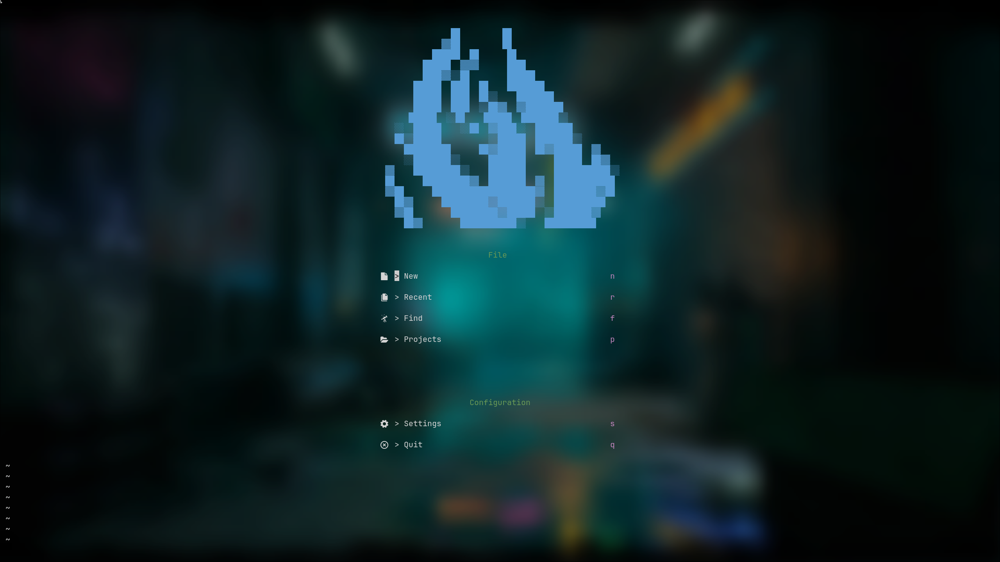
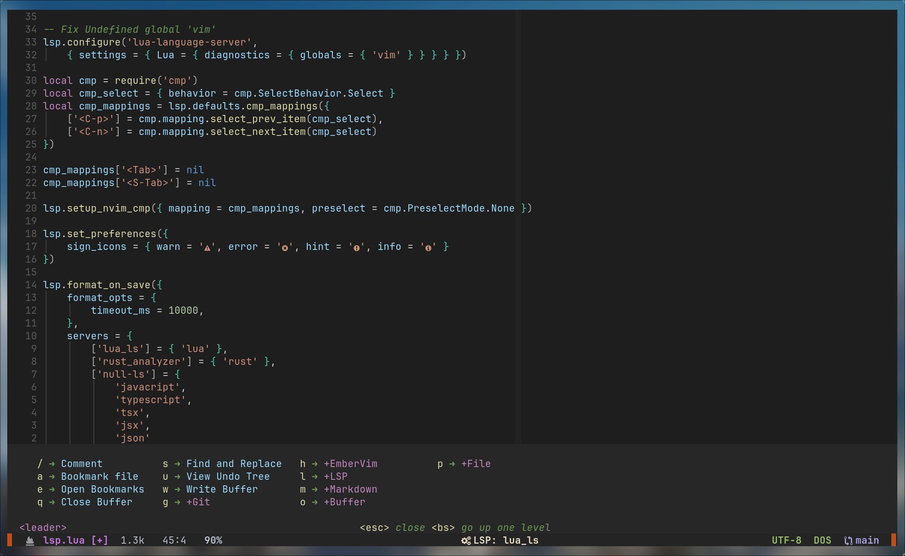
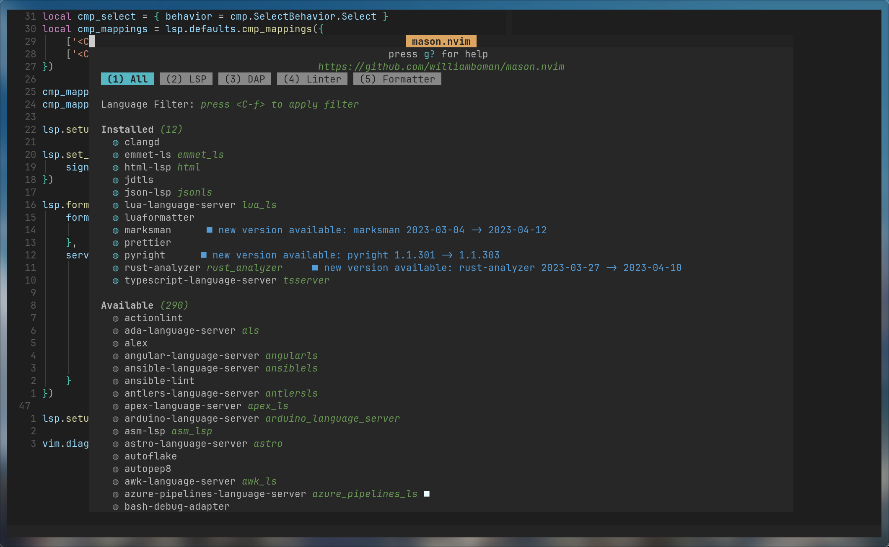

<h1 align="center">embervim</h1>

<div align="center"> 
   <a href="https://github.com/danlikestocode/embervim#Info">
   Info
   </a> 
   <span> • </span>

   <a href="https://github.com/danlikestocode/embervim#Install">
   Install
   </a> 
   <span> • </span>

   <a href="https://github.com/danlikestocode/embervim#Usage">
   Usage
   </a> 
   <span> • </span>

   <a href="https://dotfyle.com/danlikestocode/embervim-nvim">
   Plugin List
   </a>
</div>


<div align="center">
 
[](https://github.com/neovim/neovim)
[](https://github.com/NvChad/NvChad/issues)

</div>

## :camera: Showcase





## :mag: Info

embervim is yet again another neovim configuration designed to make it easy
for users not familiar with neovim to expand their own configuration. Time and 
time again I found myself switching between VSCode and neovim. I loved neovim
for its extensibility, but found that setting up LSP+Linting+Formatting was
often a headache not worth the time. So I set out to write a neovim configuration
that doesn't compromise and is easy to understand.

This configuration has a **lot** of features out of the box, that just **work**.
On top of that, this configuration was built with **Linx/Windows/MacOS** cross-compatiblity
in mind. Files are organized in a sensible fashion, without too much overhead.
Configuration files are split into a different folder for ease of use. Embervim
does not use any custom lua directory loading or any fancy handling of plugins. 
This **isn't meant to be a framework**, rather a configuration that users can build
upon. And since I'm coming from VSCode, we ship the VSCode Dark+ theme by *default*.  
  
Embervim also uses lazy loading by default, meaning that plugins will not be loaded unless
they are required by the specific filetype you are working on. This dramatically
lowers the startup time for older machines.

#### Features
- Windows + MacOS + Linux cross-compatiblity
- Lazy loaded plugins
- Github Co-pilot integration
- Modern UI
- Modern Animations
- Fuzzy finding
- Safe buffer deleting
- Auto-complete + Intellisense
- Extensibility
> Full plugin list available [here](https://dotfyle.com/danlikestocode/embervim-nvim)

## :rocket: Install
#### **Pre-requisites**  
Please make sure to install the following dependencies:

- [Neovim](https://github.com/neovim/neovim)
- [Nerd Font](https://www.nerdfonts.com/)
- [Node](https://npm.github.io/installation-setup-docs/installing/using-a-node-version-manager.html)
- [Ripgrep](https://github.com/BurntSushi/ripgrep) --- *Optional*

> The only dependency that you *really* need to use this configuration is neovim,
however if you would like to use the full feature set, *Node* is recommended. 
(LSP's and Formatters generally rely upon Node)  

#### Install
```sh
git clone https://github.com/danlikestocode/embervim ~/embervim && cp -R ~/embervim/nvim ~/.config/embervim/nvim && rm -rdf ~/embervim
```
> Keep in mind this one liner will install to `~/.config/nvim`. If you already
have a configuration there or would like to manually install embervim you may
do so by: Cloning this repo and replacing your ~/.config/nvim with the nvim
folder in the embervim repository.

## :gear: Usage
Configuration with embervim is generally *really* simple. The file structure is
as follows:
- Plugin configuration goes in `after/plugins`
- Keybinds are in `lua/embervim/keybinds.lua`
- Plugin *installation* goes in `lua/embervim/plugins.lua`  
  
Thats it! You can look at the file structure and generally figure out what
goes where. You also don't have to adhere to this specific layout but it generally
helps to have plugin configuration in the `after` directory.

Some helpful commands:
- :Mason --- *Opens up LSP install menu*
- :Lazy --- *Opens up Plugin menu*

## :newspaper: Notes
While embervim is generally a work in progress, it is **not** a framework, so breaking
changes will not affect the user. The recommended use for embervim is to copy the configuration
and use it as a *starting point* for your *own* configuration. Thanks for coming by
and checking this project out! :heart:

